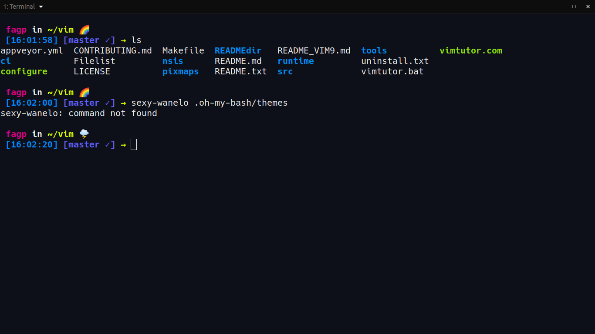
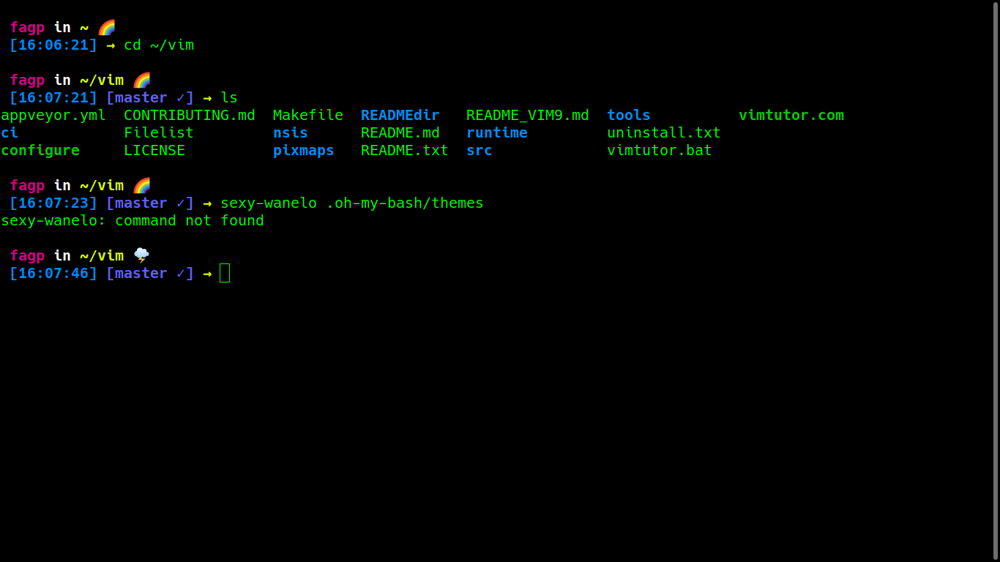
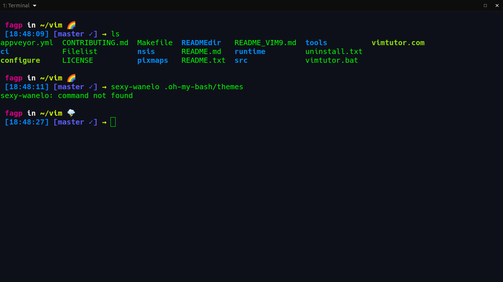

## Sexy Wanelo | oh-my-bash
A combination of sexy and wanelo theme to oh-my-bash.

I really like to pass hours in front of my computer and I love to customize things in my workflow like our shell, icons and environment. 
and when I was searching for themes to customize my bash I discover the oh-my-bash a variant of ohmyzsh, but for bash, then I looked the themes and really liked of wanelo and sexy, both are beautiful themes, and it came to my mind: Why not combine both? Then here we are, I'll show to you this beautiful theme that I think you'd like to test. 

If already you use wanelo or sexy themes, I belivie you'll like so much this theme.
This is how your shell will become:

### Use in tilix
In this case I used [tilix](https://github.com/gnunn1/tilix), with the theme [argonaut](https://github.com/storm119/Tilix-Themes/blob/master/Themes.md). And look pretty good.

Another way to use this and makes it perfect is use the own linux theme like this:

### Use in gnome terminal shell
I used this with gnome shell, and I just change the color font to green, this amazing color font changes all.

### Sexy Wanelo Best Theme
And finally what I use and finally, it was a combination of both above I really liked and I will for a while.
Just like the themes above I like to use tilix and I use the font color green and the theme argonout, it was a good choice:

If you're confuse about the font-colors just go to your terminal `preferences` and search for `default` and choose the tab `colors` finally change it to green
if you don't got it, maybe the google helps you ;)

## How to install
